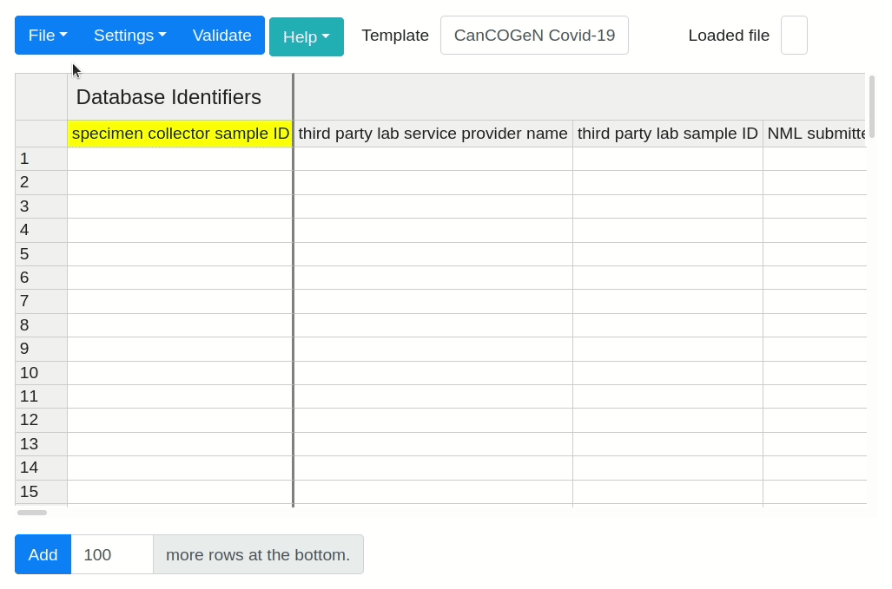

# pathogen-genomics-package

This is the DataHarmonizer spreadsheet web application bundled with pathogen genomics data entry and validation templates.  It includes templates for detailing **SARS-CoV-2 and Monkeypox** sample contextual data.  More infectious disease templates will be included in the comming year. Other organizations are adopting this version of DataHarmonizer for their own data management purposes.

## Getting Started

1) Go to [Releases](https://github.com/cidgoh/pathogen-genomics-package/releases) and download the latest package.
2) Unzip the package.
3) Run by loading the `index.html` or `main.html` files in your local web browser.

## Select Template

The default template loaded is the "CanCOGeN Covid-19" template. To change the spreadsheet template, select the white text box to the right of **Template**, it always contains the name of the template currently active, or navigated to **File** followed by **Change Template**. An in-app window will appear that allows you to select from the available templates in the drop-down menu. After selecting the desired template, click **Open** to activate the template.

DataHarmonizer and the pathogen LinkML schemas provided here ar maintained in the https://github.com/cidgoh/DataHarmonizer/ repository.
