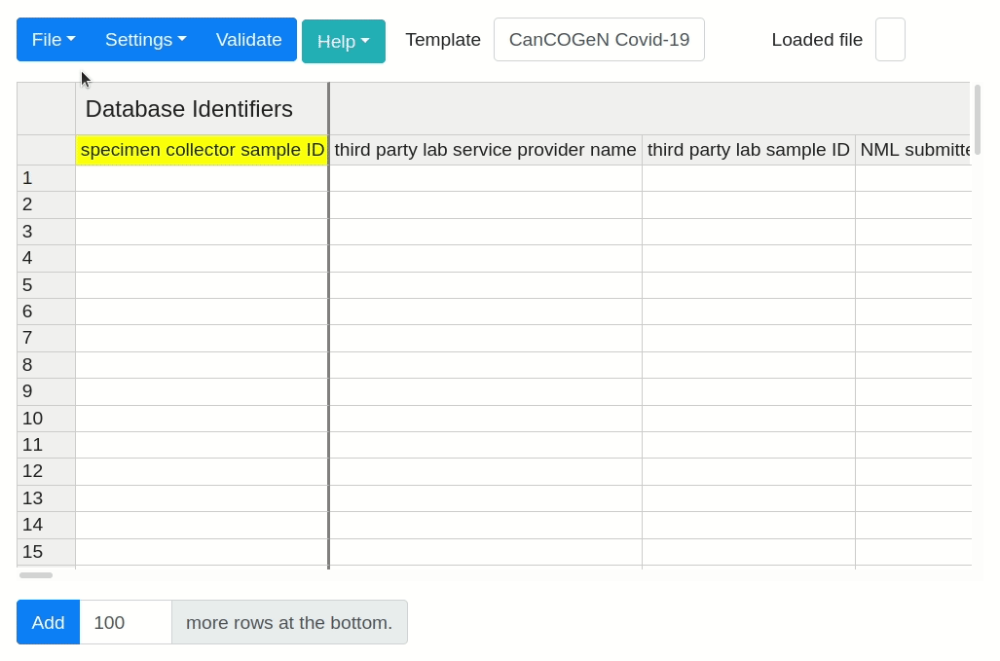

# The Pathogen Genomics Package

This is the DataHarmonizer spreadsheet web application bundled with pathogen genomics data entry and validation templates.  It includes templates for detailing **SARS-CoV-2 and Monkeypox sample contextual data; draft Influenza and Wastewater specifications; and more**.  More infectious disease templates will be included in the coming year. Other organizations are adopting this version of DataHarmonizer for their own data management purposes.

## Contextual Data Specification Packages

Several templates within the Pathogen Genomics Package are components of broader specification packages. Where applicable, these packages are listed below for reference. These packages includes reference guides, SOPs, and manuscript citations when applicable. If you believe a relevant package is missing, please submit an issue via [GitHub](https://github.com/cidgoh/pathogen-genomics-package/issues).

- AMBR Package: https://github.com/cidgoh/AMBR_Contextual_data_Specification
- B2B2B2 Package: https://github.com/cidgoh/B2B2B2_Contextual_Data_Specification
- CanCOGeN SARS-CoV-2 Package: https://github.com/cidgoh/CanCOGeN_Contextual_Data_Specification
- GRDI-AMR Package: https://github.com/cidgoh/GRDI_AMR_One_Health
- HPAI Package: https://github.com/cidgoh/HPAI_Contextual_Data_Specification
- MPox Package: https://github.com/cidgoh/MPox_Contextual_Data_Specification
- PHA4GE Minimal Pathogen Agnostic Package: https://github.com/pha4ge/minimal-pathogen-agnostic-contextual-data-specification
- PHA4GE SARS-CoV-2 Package: https://github.com/pha4ge/SARS-CoV-2-Contextual-Data-Specification
- PHA4GE Wastewater Package: https://github.com/pha4ge/Wastewater_Contextual_Data_Specification

DataHarmonizer and the pathogen LinkML schemas provided here are maintained in the https://github.com/cidgoh/DataHarmonizer/ repository.

## Getting Started

1) Go to [Releases](https://github.com/cidgoh/pathogen-genomics-package/releases) and download the latest package.
2) Unzip the package.
3) Run by loading the `index.html` or `main.html` files in your local web browser.
4) For installation guidance and additional feature information see the [training videos](https://github.com/cidgoh/pathogen-genomics-package?tab=readme-ov-file#training-videos) below.

### Quick Start: Select Template

The default template loaded is the "CanCOGeN Covid-19" template. To change the spreadsheet template, select the white text box to the right of **Template**, it always contains the name of the template currently active, or navigated to **File** followed by **Change Template**. An in-app window will appear that allows you to select from the available templates in the drop-down menu. After selecting the desired template, click **Open** to activate the template.

### Training Videos
#### The DataHarmonizer - Getting Started: Installation (1:49)

#### The DataHarmonizer - Getting Started: Features (7:55)

## Support
If you have any ideas for improving the application, or have encountered any problems running the application, [please open an issue for discussion](https://github.com/cidgoh/pathogen-genomics-package/issues).

## Additional Information
For more information about the DataHarmonizer, it's templates, and how to use them, check out the [Pathogen-Genomics-Package Wiki](https://github.com/cidgoh/pathogen-genomics-package/wiki), the [DataHarmonizer Repository](https://github.com/cidgoh/DataHarmonizer/), and the [DataHarmonizer Wiki](https://github.com/cidgoh/DataHarmonizer/wiki).
